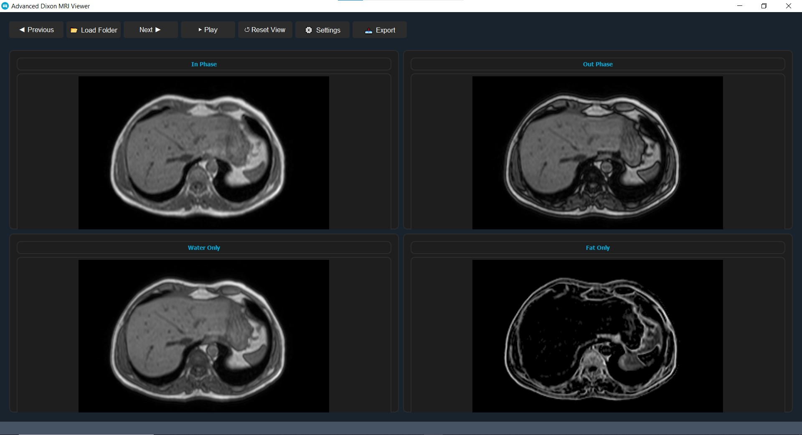

# Advanced Dixon MRI Viewer

[](https://opensource.org/licenses/MIT)
[](https://www.python.org/downloads/)
[](https://pypi.org/project/PyQt5/)

A medical imaging application designed for processing and analyzing Dixon MRI sequences, with a focus on fat-water separation techniques. This tool provides researchers and clinicians with an intuitive interface for viewing and processing Dixon MRI data.



## Table of Contents
- [Features](#features)
- [Installation](#installation)
  - [Prerequisites](#prerequisites)
  - [Setup](#setup)
- [Usage](#usage)
  - [Loading Data](#loading-data)
  - [Navigating Data](#play-images-and-navigate-right-and-left)
  - [Processing and Visualization](#processing-and-visualization-parameters)
  - [Export Options](#exporting)
- [Technical Details](#technical-details)
  - [Dixon Method Implementation](#dixon-method-implementation)
  - [Image Processing Pipeline](#image-processing-pipeline)
- [Contributing](#contributing)
  - [Pull Request Process](#pull-request-process)
- [Research Background](#research-background)
- [Citing This Software](#citing-this-software)
- [License](#license)
- [Acknowledgments](#acknowledgments)
  - [Special thanks to Siemens Healthineers Subzone Egypt and SBME Faculty](#special-thanks-to-siemens-healthineers-subzone-egypt-and-sbme-faculty)
- [Contributors](#contributors)

## Features

### Core Functionality
- Dixon fat-water separation algorithm implementation
- Real-time image processing and visualization
- Support for DICOM format
- Customizable window adjustments

### Image Processing
- Multiple noise reduction methods:
  - Gaussian filtering
  - Median filtering
  - Bilateral filtering
- Customizable fat threshold selection

### User Interface
- Dark mode optimized for clinical environments
- Quadrant view showing all processing stages
- Intuitive navigation between scans
- Comprehensive settings management

## Installation

### Prerequisites
```bash
# Python dependencies
pip install -r requirements.txt
```

### Setup
1. Clone the repository:
```bash
git clone https://github.com/nouran-19/Fat-and-Water-Suppression-Dixon-Technique-Dicom-Images.git
cd Fat-and-Water-Suppression-Dixon-Technique-Dicom-Images
```

2. Install dependencies:
```bash
pip install -r requirements.txt
```

3. Run the application:
```bash
python app.py
```
- If you have had any problems, [open an issue ↗️](https://github.com/nouran-19/Fat-and-Water-Suppression-Dixon-Technique-Dicom-Images/issues/new).
## Usage

### Loading Data
The application expects these specific directory structures, dicom files should be paired in order, i.e. the first dicom image in the 'inphase' directory should be paired with the first dicom image in the 'outphase' directory, and so on and so forth. Dataset sample is already uploaded.
```
main_folder/
    any_name/
        any_other_name/
            inphase/
                *.dcm
            outphase/
                *.dcm

# or

main_folder/
    random_name/
        inphase/
            *.dcm
        outphase/
            *.dcm

# or even

main_folder/
    inphase/
        *.dcm
    outphase/
        *.dcm
```


### Play images and navigate right and left

This gif shows the process of navigating the images (if there are more than one)


### Processing and Visualization Parameters
Key parameters that affect fat-water separation and visualization:

| Parameter | Default | Range/Options | Description |
|-----------|---------|--------|-------------|
| Fat Threshold | 0.1 | 0.0-1.0 | Minimum fat signal intensity |
| Noise Reduction | None | Gaussian, Median, Bilateral | Smooting and denoising |
| Contrast and Brightness | 0 | -50 : 50 | Brightness and contrast control |

These gifs show the processing and visualization in the app


### Exporting

Supported export formats are: ["DICOM", "PNG", "JPEG", "TIFF", "GIF"], with loop option and frame duration for "GIF" type. Additionally, there's a 'compress' option for all the formats.
<br>
<br>
These gifs show the exporting process. 
<br>
First, exporting in dicom format, and opening the exported files to test the output.


Second, exporting in gif and PNG formats shows the compression effect.


## Technical Details

### Dixon Method Implementation
The software implements both basic and advanced Dixon methods:

1. Basic Dixon:
```python
water = (in_phase + out_phase) / 2.0
fat = (in_phase - out_phase) / 2.0
```


### Image Processing Pipeline
1. DICOM loading and validation
2. Noise reduction (optional)
3. Fat-water separation
4. Post-processing and enhancement
5. Display optimization

## Contributing

### Development Setup
1. Fork the repository
2. Create a virtual environment:
```bash
python -m venv venv
source venv/bin/activate  # Linux/Mac
venv\Scripts\activate     # Windows
```

3. Install development dependencies:
```bash
pip install -r requirements.txt
```

### Pull Request Process

Check [the open issues 🚩](https://github.com/nouran-19/Fat-and-Water-Suppression-Dixon-Technique-Dicom-Images/issues?q=is%3Aopen) for suggestions.

1. Create a feature branch:
```bash
git checkout -b feature/your-feature-name
```

2. Commit your changes:
```bash
git commit -m "add new feature"
```
3. Push to your fork and submit a pull request

4. Ensure your PR:
- Is bugs free
- Updates documentation
- Includes test coverage

## Research Background
This implementation is based on the Dixon method for fat-water separation in MRI, first proposed by Thomas Dixon in 1984. 

## Key References

1. Dixon, W.T. (1984). Simple proton spectroscopic imaging. Radiology, 153(1), 189-194.
2. Elster, A.D. (2024). Dixon Method. In Questions and Answers in MRI. ELSTER LLC. Retrieved from https://mriquestions.com/dixon-method.html 
## Citing This Software
If you use this software in your research, please cite:
```bibtex
@software{advanced_dixon_mri_viewer,
  author       = {Yasmin ElGamal, Salma Ashraf, Rana Hany, Sarah Ibrahim, Nouran Khatab},
  title        = {Advanced Dixon MRI Viewer},
  year         = {2024},
  publisher    = {GitHub},
  url          = {https://github.com/nouran-19/Fat-and-Water-Suppression-Dixon-Technique-Dicom-Images}
}
```

## License
This project is licensed under the MIT License - see the [LICENSE](LICENSE) file for details.

## Acknowledgments
- PyQt5 team for the GUI framework
- Pydicom contributors for DICOM handling
- NumPy community for numerical computing support
- Research community for Dixon method improvements

### Special thanks to Siemens Healthineers Subzone Egypt and SBME Faculty
- Special thanks to [Eng. Amr El Ghorab](https://www.linkedin.com/in/amr-el-ghorab-b685ba284/?trk=public_profile_samename-profile&originalSubdomain=eg) Head of Service Department at Siemens Healthineers Subzone Egypt and MRI lectures instructor.
<div align="center">
  <a href="https://www.linkedin.com/in/amr-el-ghorab-b685ba284/?trk=public_profile_samename-profile&originalSubdomain=eg"></a>
</div>

- <a href="https://scholar.google.com.eg/citations?user=8Ot_JkYAAAAJ&hl=en">Dr. Ahmed M. Ehab Mahmoud</a>, COO and Co-Founder at Astute Imaging, and <a href="https://scholar.google.com/citations?user=8w2DZLIAAAAJ&hl=en">Eng. Ola Sarhan</a>, Teaching Assistant at Faculty of Engineering Cairo University.

<div align="center">
  <a href="https://www.linkedin.com/in/ahmedmahmoud/"></a>      <a href="https://www.linkedin.com/in/ola-sarhan-162014as/?originalSubdomain=eg"></a>
</div>

---
Made with ❤️ for the course: SBE4120 Medical Imaging, Fall 2024, Instructed by Siemens Healthineers, Subzone Egypt.

## Contributors:
<div align="center">
  
| <a href="https://github.com/JasmineTJ"></a> | <a href="https://github.com/Salma-me"></a> | <a href="https://github.com/RanaHany10"></a> | <a href="https://github.com/sarah1ibrahim"></a> | <a href="https://github.com/nouran-19"></a> |
|:---:|:---:|:---:|:---:|:---:|
| [Yasmin ElGamal](https://github.com/JasmineTJ) | [Salma Ashraf](https://github.com/Salma-me) | [Rana Hany](https://github.com/RanaHany10) | [Sarah Ibrahim](https://github.com/sarah1ibrahim) | [Nouran Khatab](https://github.com/nouran-19) 

</div>

